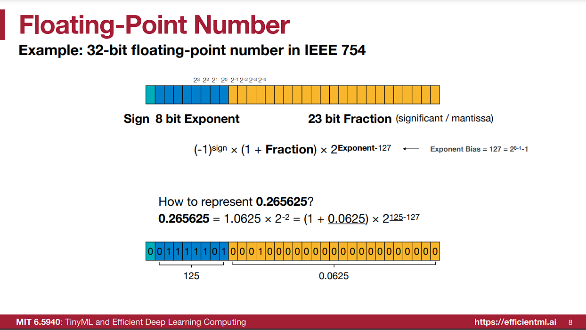
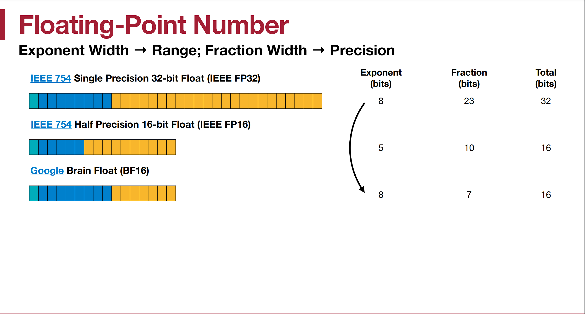
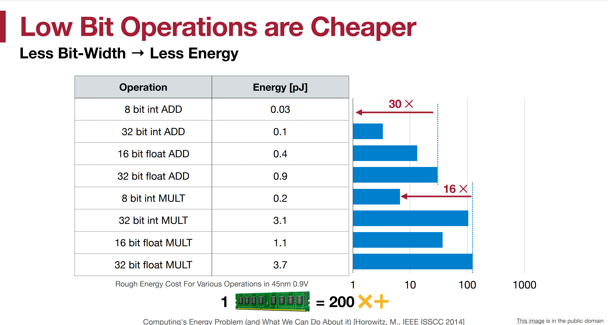

# Lec 5 and 6-Quantization

## 数据类型（Numeric Data Types）

### 整形（Integer）

- **无符号整形（Unsigned Integer）**：
    - $n$ -bit 可表示整形范围为 $[0,2^n-1]$ 

- **有符号整形（Signed Integer）**：
    - 原码的表示方式
    -  $n$ -bit 可表示的整形范围为 $[-2^{n-1}+1,2^{n-1}-1]$
    - 000…00 和100...00都表示数字 0
- **补码（Two’s Complement Representation）**:
    - $n$ -bit 可表示的整形范围为 $[-2^{n-1},2^{n-1}-1]$
    - 000…00 表示数字 0
    - 100…00 表示数字 $-2^{n-1}$

### 浮点数（Floating-Point Number）

以 $32$-bit 浮点数在IEEE 754 标准中的表示方法为例

- 第一位为符号位（sign）：0 表示正数，1 表示负数
- 后面 8 位为指数位（Exponent）
- 最后 23 位为小数位（Fraction）（significant figures（有效数字）/mantissa（尾数））
- 表示的数字即为：

$$
(-1)^{sign}\times(1+Fraction)\times2^{Exponent-127}\\
(1)
$$

其中最后指数部分的 127 为指数偏置，$127=2^{8-1}-1$

**Subnormal Numbers**：

根据上述式(1)的表达方式，最小的数字（最接近于 0 的浮点数）为
$$
2^{-126}=(1+0)\times2^{1-127}
$$
正规数的 expoent 不为 0，0 这一档空出来表示非正规数

非正规数没有前置 1，exponent 为 0，防止数值计算突然变成 0，提高了数值的稳定性

硬件计算中几乎不用到 subnormal

## 量化

什么是量化（Quantization）？

量化是将一个来自连续集合或其他取值范围很大的集合的输入，限制并映射到一个离散取值集合中的过程

为什么需要量化？

如图，低比特数据运算功耗低于高比特数据，整形数据运算功耗低于浮点数运算，因此将高位、浮点数类型的数据运算转化为低位、整形类型的数据可以大大节省算力

### Weight Quantization

神经网络中
$$
y=Wx+b
$$
Weight Quantization 只针对权重 **W**

#### K-Means-based Weight Quantization

- 设定聚类数 $K=2^n$ （对应 n-bit 量化）
- 使用 K-means 将权重聚成 K 类
- 每个权重用 index+codebook 表示
- 通过反向传播微调更新聚类中心，从而恢复精度，微调数学原理见[数学原理](#补充1：K-Means微调的数学原理)

## 补充

### 补充1：K-Means微调的数学原理