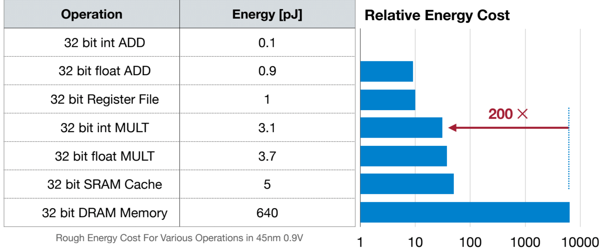

# Lecture 3 and 4-Prunning

## 背景

**对大模型的剪枝效果**

对模型 Llama 270B 开放组的提交中，在保持 99% 准确率的同时，实现了2.5倍的加速

深度剪枝：80层减少到32层

宽度剪枝：将28762的中间维度减少到14336

**内存是有限的**

含义

- 使用更多显存/内存的代价很高
- 包括硬件成本高、能耗高、运行代价高

必须减少内存占用，否则成本太大

数据移动产生读写以及运算导致能量消耗

不难发现，32位整形与浮点数的加法与乘法运算能量开销较小，而32位的DRAM（Dynamic Random Access Memory）内存访问能耗大约是加法和乘法操作的两百倍。于是瓶颈在于DRAM访问次数

## 神经网络剪枝是什么

通过移除一些神经元和连接使得神经网络规模更小

### 剪枝流程（pipeline）

- 1.Train Connectivity（训练网络结构的连接）
- 2.Prune Connections（剪掉不重要的连接）
- 3.Train Weights（重新训练剩下的权重）

这三步反复迭代，就是Iterative Pruning（迭代剪枝）

### 剪枝效果

- 只剪枝不微调，模型精度会掉得非常厉害
- 最佳策略：迭代剪枝加微调，一边剪一边训练，慢慢剪，精度损失最小

## 剪枝细粒度（Pruning Granularity）

剪枝可以在不同粒度上进行，从结构化到非结构化

### Fine-grained/Unstructured

- 可剪枝的位置灵活
- 但难以在硬件上加速

### Coarse-grained/Structured

- 灵活性较小
- 便于加速

#### Pattern-based Pruning

- N:M sparisity ：在每相邻的 M 个元素中，减去 N 个
- 经典比例是 2:4
- 这样的比例可以通过 NVDIA的 Ampere 架构实现硬件及加速

### channel Pruning

- 通过直接减去通道数量实现加速，不需要额外的硬件支持
- 比较小的压缩比例

## 剪枝标准（criterion）

哪些突触和神经元应当减去

### Magnitude-based Pruning

- 对于Magnitude-based Pruning，绝对值较大的权重重要性更大

即
$$
Importance=|W|
$$

#### 一种启发式的剪枝标准

不单独考虑一个结点，而是考虑集合中所有的权重的共同的影响

引入 $L_P-norm$

定义
$$
Importance=\sqrt[p]{\sum_{i\in S}[w_i]^p}
$$

### Scaling-based Pruning

对于 filter 剪枝的标准

（）

### Second-Order-based Pruning

再减去突触的时候最小化损失函数

将损失函数二阶泰勒展开
$$
\delta L=L(x,W)-L(x,W_p=W-\delta W)=\sum_i g_i\delta w_i+\frac{1}{2}\sum_ih_{ii}\delta w_i^2+\sum_{i\neq j}h_{ij}\delta w_i\delta w_j+O(\|\delta W\|^3)
$$

近似认为
$$
\delta L_i=L(x,W)-L(x,W_p|w_p=0)\approx\frac{1}{2}h_{ii}w_i^2
$$
于是就有
$$
importance{_{w_i}}=|\delta L_i|=\frac{1}{2}h_{ii}w_i^2
$$
 $h_{ii}$ 是非负的

### Percentage-of-Zero-Based Pruning

### Regression-based Pruning

